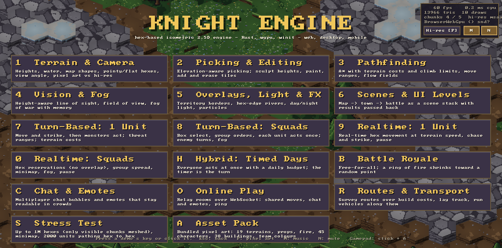
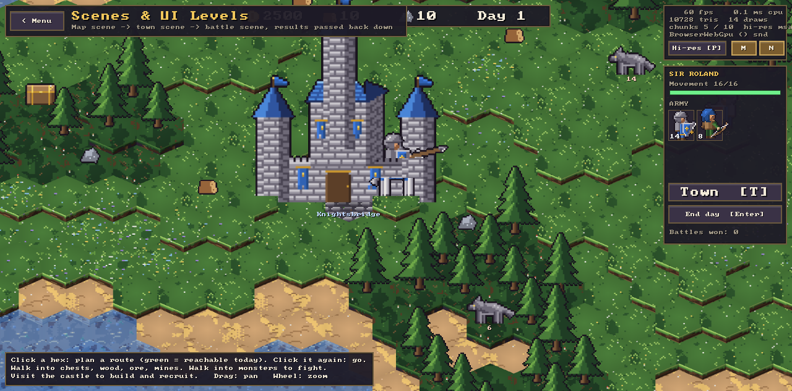
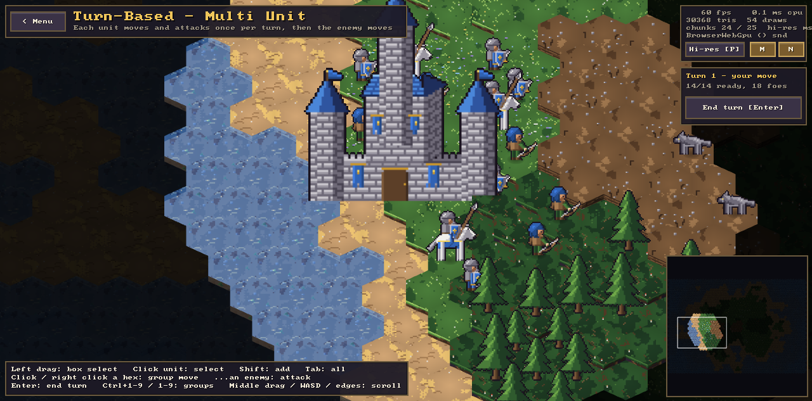
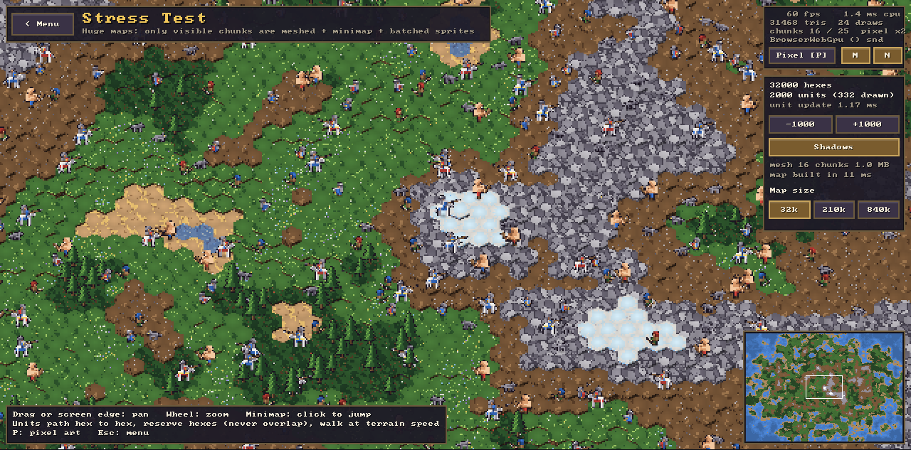
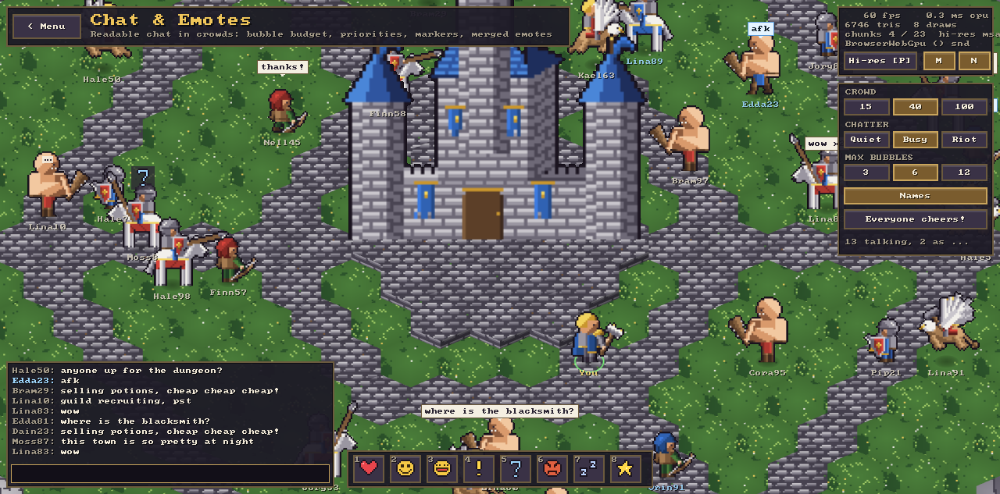
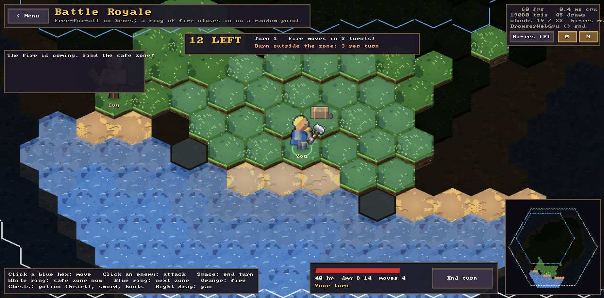
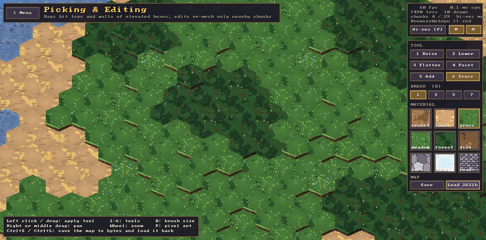

# Knight Engine

**A hex-based, isometric 2.5D game engine in Rust — for strategy and RPG games that run on the
web, the desktop and mobile from one codebase.**

Heroes-style adventure maps, Diablo-style RPGs, Warcraft-style squad battles, Railroad
Tycoon-style builders: Knight gives you the hex grid, the terrain, the camera, the renderer and the
game-loop plumbing, so you can spend your time on the game. It is built on
[wgpu](https://wgpu.rs) and [winit](https://github.com/rust-windowing/winit), renders with WebGPU
(falling back to WebGL2 in older browsers), and follows
[Red Blob Games' hexagon guide](https://www.redblobgames.com/grids/hexagons/) for all grid math.



<table>
  <tr>
    <td></td>
    <td></td>
  </tr>
  <tr>
    <td align="center"><sub>Adventure map → town → battle, as a scene stack</sub></td>
    <td align="center"><sub>Turn-based squads with fog of war and a minimap</sub></td>
  </tr>
  <tr>
    <td></td>
    <td></td>
  </tr>
  <tr>
    <td align="center"><sub>2,000 units walking hex to hex, pixel-art mode, 60 fps in the browser</sub></td>
    <td align="center"><sub>Chat bubbles and emotes that stay readable in a crowd</sub></td>
  </tr>
</table>

## Why Knight

- **Hexes all the way down.** Everything that moves goes hex to hex through one navigation type,
  so turn-based, real-time and hybrid games share pathfinding, occupancy and terrain costs.
- **Huge maps are cheap.** Terrain is meshed lazily, only for the chunks on screen, and evicted
  when unused. A four-million-hex map loads in about 150 ms and uses tens of megabytes.
- **Pixel-perfect or smooth, your choice.** A pixel-art mode renders at low resolution with
  nearest upscaling, pixel snapping and pixel-perfect zoom. A hi-res mode uses linear filtering
  and 4× MSAA. The UI stays crisp on high-DPI screens either way.
- **Batteries included, no asset pipeline required.** A bundled pixel-art pack (terrain, props,
  45 characters, 38 buildings, team colours), synthesized sound effects and chiptune music, and
  a built-in font mean a game can run with zero external files.
- **Runs everywhere wgpu does.** The same game builds for the browser, Windows, macOS and Linux,
  with gamepads, touch and audio handled for you.

## Features

**World**
- Hex grids: axial, cube, offset and doubled coordinates; pointy and flat layouts; rings,
  spirals, lines, rotation and reflection; hexagon, rectangle, rhombus and triangle maps.
- Terrain: per-hex height levels (hills and depressions), a water plane with visible submerged
  ground, textured materials, stacked cliff walls, and animated water and lava.
- Elevation-aware picking: rays hit tile tops and walls, so tall hexes hide the ones behind them.
- Fog of war (hidden, explored, visible) that only rebuilds what changed.
- Save and load a map to a compact byte blob with `HexWorld::to_bytes` / `load_bytes`.

**Gameplay**
- A* with arbitrary step costs, budgeted movement ranges, flow fields for crowds, and
  height-aware line of sight and field of view.
- `HexMover` walks routes of adjacent hexes at the speed the terrain allows. `Reservations` let
  real-time units queue instead of overlapping.
- Turn modes: turn-based, real time, and hybrid timed days (`DayClock` + `ActionBudget`).
- Closing-in hazards: a phased `ShrinkingZone` and a spreading `Wildfire` for battle royale modes.
- A seeded RNG and value noise for procedural maps.

**Presentation**
- A fixed-direction isometric camera: pan by drag, keys or screen edge; zoom at the cursor;
  configurable viewing angle from 30° to top-down.
- Depth-correct upright sprites with shadows, ground decals, overlays, territory borders,
  hex-edge rivers and walls, world-anchored labels and bars.
- Per-camera ambient light for day and night, particles for sparks, smoke and fire.
- Several cameras per frame, gradient backdrops, and a one-image minimap for any map size.

**Engine**
- A scene stack for multiple UI levels, with fade transitions and results passed back down.
- Immediate-mode UI: panels, buttons, bars, text fields, tooltips, wrapped text and images.
- Input: mouse, keyboard, touch gestures and gamepads. The first pad drives a virtual cursor, so
  every game is controller-playable out of the box.
- Audio: a mixer with positional sound and looping music, from WAV files or synthesized at startup.
- Networking: a binary codec, a relay protocol with rooms, WebSocket transports for native and
  web, an in-process hub for tests and hot seat, and deterministic lockstep.

## Quick start

Add `knight-engine` as a dependency, then:

```rust
use knight_engine::*;

struct Hello { world: HexWorld, camera: Camera, controls: CameraController }

impl Scene for Hello {
    fn update(&mut self, ctx: &mut Context) -> Transition {
        self.camera.viewport = ctx.screen_rect();
        self.camera.dpr = ctx.scale_factor;
        self.controls.update(&mut self.camera, &ctx.input, ctx.time.dt, ctx.input.pointer_over_ui());
        Transition::None
    }

    fn draw(&mut self, f: &mut Frame) {
        let hover = self.world.pick(self.camera.screen_ray(f.ctx.input.mouse));
        let mut w = f.world(&mut self.world, &self.camera);
        if let Some(p) = hover {
            w.hex_outline(p.hex, Color::YELLOW, 0.1);
        }
    }
}

fn main() {
    run(AppConfig::default(), |_ctx| {
        let mut world = HexWorld::new(hex::Layout::pointy(1.0));
        for h in hex::shapes::hexagon(hex::Hex::ORIGIN, 10) {
            world.set_tile(h, Tile::new((h.q.abs() % 3) as i16, 0));
        }
        Box::new(Hello { world, camera: Camera::new(glam::Vec3::ZERO, 40.0), controls: CameraController::default() })
    });
}
```

Run it with `cargo run -p knight-engine --example hello`. A game depends only on
`knight-engine`, which re-exports the core, the hex math (as `hex`) and networking (as `net`,
behind the default `net` feature).

## The sandbox

`apps/sandbox` is an interactive tour of the engine: 17 demos, each named after the features it
shows. It is a separate app, not part of the engine, and nothing in the engine depends on it.

| Key | Demo | Shows |
| --- | --- | --- |
| 1 | Terrain & Camera | Heights, water, map shapes, pointy/flat hexes, view angle, render modes |
| 2 | Picking & Editing | Elevation-aware picking, sculpting and painting, map save/load |
| 3 | Pathfinding | A* with terrain costs and climb limits, move ranges, flow fields |
| 4 | Vision & Fog | Line of sight, field of view, fog of war with memory |
| 5 | Overlays, Light & FX | Territory borders, hex-edge rivers, day/night, particles |
| 6 | Scenes & UI Levels | Map → town → battle with results passed back |
| 7, 8 | Turn-Based | One unit, and squads with box select and enemy turns |
| 9, 0 | Realtime | One unit, and squads with hex reservations and pause |
| H | Hybrid: Timed Days | Everyone acts at once within a daily budget |
| B | Battle Royale | Free-for-all inside a shrinking ring of fire |
| C | Chat & Emotes | Bubbles and emotes that stay readable in crowds |
| O | Online Play | Relay rooms over WebSocket, or practice against a bot |
| R | Routes & Transport | Survey routes, lay track, run vehicles along them |
| S | Stress Test | Up to 840k hexes and 2,000 units pathing hex to hex |
| A | Asset Pack | Every terrain, prop, character and building in the pack |

`Esc` goes back, `P` toggles pixel-art rendering, `M` toggles music and `N` mutes. With a gamepad,
move the cursor with the left stick and press A.

<p align="center"> </p>

### Running it

You need Rust from [rustup](https://rustup.rs); the toolchain file adds the
`wasm32-unknown-unknown` target. The web build also needs `wasm-bindgen-cli` 0.2.129
(`cargo install wasm-bindgen-cli --version 0.2.129`).

```sh
cargo run -p knight-sandbox --release   # native window
scripts/web.sh serve                    # web build, then http://localhost:8080
cargo run -p knight-relay --release     # relay for Online Play (ws://localhost:9001)
```

Add `?backend=webgl2` to the web URL to force the WebGL2 fallback.

## Workspace

| Crate | Purpose |
| --- | --- |
| `crates/knight-hex` | Hex math, pathfinding, vision and noise. No dependencies. |
| `crates/knight-core` | Worlds, camera, picking, meshing, frame and UI, scenes, input, assets, audio. No GPU code, so it is fully unit-tested. |
| `crates/knight-assets` | The bundled pixel-art pack, loaded and cached on demand. |
| `crates/knight-net` | Codec, relay protocol, WebSocket and in-process transports, lockstep. |
| `crates/knight-engine` | The wgpu renderer, winit runtime, audio output and gamepads. Re-exports everything a game needs. |
| `apps/relay` | A small WebSocket relay server with rooms. |
| `apps/sandbox` | The demo app, native and web. |

## Development

```sh
cargo test --workspace                          # unit tests, including a headless battle sim
cargo clippy --workspace --all-targets          # kept warning-free
cargo fmt --all
cargo run -p knight-core --example bench_terrain --release   # 128² to 2048² map benchmark
```

[AGENTS.md](AGENTS.md) describes the architecture, the key design decisions and how to verify
changes in a real browser.

## Platforms

| Target | Status |
| --- | --- |
| Web (WebGPU / WebGL2) | Verified in Chrome on both backends, at DPR 1 to 3 and phone viewports |
| macOS (Metal) | Runs natively |
| Windows (DX12 / Vulkan), Linux (Vulkan / GL) | Supported by wgpu and winit, not yet tested |
| iOS, Android | Supported by wgpu and winit; packaging is not set up yet |
| Consoles | Need NDA platform SDKs; out of scope for this repository |

Not implemented yet: NAT-traversing peer-to-peer transports (WebRTC, Steam) and rollback
netcode. The relay plus lockstep cover turn-based, hybrid and fixed-tick games.
